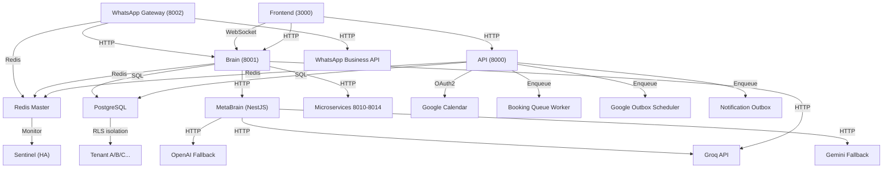

# GSENTINELHEALTHOS - MASTER PRODUCTION PLAN

**Versión**: 1.0  
**Fecha**: 16 de mayo de 2026  
**Clasificación**: ESTRATÉGICO - ARQUITECTURA EMPRESARIAL  
**Estado**: LISTO PARA EJECUCIÓN PROFESIONAL  

---

## EXECUTIVE SUMMARY

GSentinelHealthOS es una **plataforma SaaS médica empresarial** en transición desde arquitectura experimental hacia **producción clínica controlada**.

### Estado Global
| Dimensión | Resultado | Riesgo |
|-----------|-----------|--------|
| Arquitectura | ✓ 8/10 | Bajo |
| Runtime | ⚠ 2/10 | Crítico |
| IA Clínica | ✗ 0/10 | Crítico |
| Seguridad | ✓ 6/10 | Alto |
| Infraestructura | ✓ 7/10 | Medio |
| Observabilidad | ⚠ 5/10 | Alto |
| PHI/Compliance | ⚠ 5/10 | Crítico |

### Declaración Honesta
**No se puede lanzar a producción SIN ejecutar este plan.**

El sistema actual es **safe by default** pero **completamente inmaduro** para IA clínica activa.

---

## 1. ARQUITECTURA GLOBAL DEL SISTEMA

### 1.1 Mapa Conceptual de Alto Nivel

```
┌─────────────────────────────────────────────────────────────────────┐
│                         GSENTINELHEALTHOS                           │
│                                                                     │
│  ┌────────────────────────────────────────────────────────────┐   │
│  │                    TENANT / CLINIC                         │   │
│  │  (Multi-tenant isolation via database RLS)                │   │
│  └────────────────────────────────────────────────────────────┘   │
│                                                                     │
│  ┌─────────────────────────────────────────────────────────┐      │
│  │ PRESENTATION LAYER (Frontend)                           │      │
│  ├─────────────────────────────────────────────────────────┤      │
│  │ • medical-agenda-saas (Next.js) → Port 3000            │      │
│  │ • Panel-SuperAdmin (Next.js) → Port 3010               │      │
│  │ • Browser-based (React, TailwindCSS, Shadcn/ui)        │      │
│  └─────────────────────────────────────────────────────────┘      │
│                         ↓ HTTP/REST                                 │
│  ┌─────────────────────────────────────────────────────────┐      │
│  │ API GATEWAY LAYER (Edge)                                │      │
│  ├─────────────────────────────────────────────────────────┤      │
│  │ • WhatsApp Gateway (FastAPI) → Port 8002               │      │
│  │   └─ Webhook ingress, message queue bridging            │      │
│  │                                                          │      │
│  │ • JWT/Auth middleware                                   │      │
│  │ • Rate limiting (Redis-backed)                          │      │
│  │ • CORS/IdempotencyMiddleware                            │      │
│  └─────────────────────────────────────────────────────────┘      │
│                         ↓ HTTP/Redis                                │
│  ┌──────────────────────┬──────────────────────┐                  │
│  │ SYNCHRONOUS SERVICES │ ASYNCHRONOUS WORKERS │                  │
│  ├──────────────────────┼──────────────────────┤                  │
│  │ • API (FastAPI)      │ • Brain Redis Worker │                  │
│  │   Port 8000          │   (main.py, async)   │                  │
│  │   - Appointments     │                      │                  │
│  │   - Authentication   │ • Booking Queue      │                  │
│  │   - Patients/Doctors │   (16 shards)        │                  │
│  │   - Health checks    │                      │                  │
│  │                      │ • Google Outbox      │                  │
│  │ • Brain (FastAPI)    │   Scheduler          │                  │
│  │   Port 8001          │                      │                  │
│  │   - Orchestration    │ • Notification       │                  │
│  │   - Decision engine  │   Outbox Scheduler   │                  │
│  │   - State mgmt       │                      │                  │
│  │                      │ • Microservices      │                  │
│  │ • MetaBrain (NestJS) │   (Dialogue, Infer,  │                  │
│  │   Embedded           │    Decision, NLG)    │                  │
│  │   - AI orchestration │                      │                  │
│  │   - Provider router  │                      │                  │
│  │   - Safety controls  │                      │                  │
│  └──────────────────────┴──────────────────────┘                  │
│                         ↓ SQL + Redis                              │
│  ┌────────────────────────────────────────────────────────┐      │
│  │ PERSISTENCE LAYER                                       │      │
│  ├────────────────────────────────────────────────────────┤      │
│  │ • PostgreSQL 16 (Primary)                              │      │
│  │   ├─ Medical data (Appointments, Patients, Doctors)    │      │
│  │   ├─ Event outbox (Transactional inbox pattern)        │      │
│  │   ├─ Google Calendar sync state                        │      │
│  │   ├─ WhatsApp account multi-tenancy                    │      │
│  │   ├─ Clinical records, imaging results                 │      │
│  │   └─ Audit trail, PHI protection via RLS              │      │
│  │                                                         │      │
│  │ • Redis (Cache + Queue + State)                        │      │
│  │   ├─ Master (Port 6379)                                │      │
│  │   ├─ Replica (read-only, HA)                           │      │
│  │   ├─ Sentinel (3x, orchestration)                      │      │
│  │   └─ Queues: whatsapp:incoming, whatsapp:outgoing     │      │
│  │             queue:booking:shard:*, state:*, cache:*    │      │
│  │                                                         │      │
│  │ • File Storage (/data/uploads)                         │      │
│  │   └─ Medical documents, prescriptions, images          │      │
│  └────────────────────────────────────────────────────────┘      │
│                                                                     │
│  ┌──────────────────────────────────────────────────────┐        │
│  │ EXTERNAL INTEGRATIONS                               │        │
│  ├──────────────────────────────────────────────────────┤        │
│  │ • WhatsApp Business API (Meta)                       │        │
│  │ • Google Calendar (OAuth2, push notifications)       │        │
│  │ • Groq AI (primary LLM provider)                     │        │
│  │ • Fallback providers (OpenAI, Gemini, Local)         │        │
│  │ • Document AI (Google Cloud, medical PDFs)           │        │
│  └──────────────────────────────────────────────────────┘        │
│                                                                     │
│  ┌──────────────────────────────────────────────────────┐        │
│  │ AI ORCHESTRATION LAYER (MetaBrain)                  │        │
│  ├──────────────────────────────────────────────────────┤        │
│  │ • 7 Formal Layers (Parallel, Disconnected)           │        │
│  │   ├─ Semantic Memory (read/write memory)              │        │
│  │   ├─ Image Intelligence (DICOM, medical imaging)      │        │
│  │   ├─ Provider Router (multi-LLM orchestration)        │        │
│  │   ├─ Human Review (clinical review queue)             │        │
│  │   ├─ Clinical Confidence (uncertainty scoring)        │        │
│  │   ├─ Observability (tracing, audit)                   │        │
│  │   └─ Production Safety (kill switch, guardrails)      │        │
│  │                                                       │        │
│  │ • Status: All 7 layers DISABLED by default            │        │
│  │ • Feature flags: AI_RUNTIME_ENABLED=false            │        │
│  │ • Default behavior: Fallback to safe operations       │        │
│  └──────────────────────────────────────────────────────┘        │
└─────────────────────────────────────────────────────────────────────┘
```

### 1.2 Dependencias Críticas de Primer Orden



---

## 2. BLOQUES GRANDES DEL SISTEMA

### BLOQUE A — CORE INFRASTRUCTURE
**Responsabilidad**: Base de datos, cache, networking, orchestration  
**Criticidad**: CRÍTICA

#### 2.A.1 Componentes
- PostgreSQL 16 (gs_db container)
- Redis 8 + Sentinel HA (gs_redis_master, gs_redis_replica, 3x sentinel)
- Docker Compose orchestration
- Volume management (`uploads_data`)
- Network bridge (`gs_prod`)

#### 2.A.2 Estado Actual
| Aspecto | Estado | Riesgo |
|---------|--------|--------|
| Database | ✓ Operativo | Bajo |
| Redis HA | ✓ Operativo | Bajo |
| Migrations | ✓ Automático | Medio (Dual ORM) |
| Network | ✓ Aislado | Bajo |
| Storage | ✓ Volumes | Medio |

#### 2.A.3 Dependencias
- All backend services → PostgreSQL
- All real-time features → Redis
- Microservices orchestration → Docker compose
- Transactional guarantees → Outbox pattern

#### 2.A.4 Riesgos
1. **Dual ORM**: SQLAlchemy (API/Brain) + Prisma (frontend) → Riesgo de desincronización
2. **Schema versioning**: Alembic + Prisma migrations = complejidad
3. **Redis persistence**: AOF/RDB setup unclear, Sentinel failover untested
4. **Storage**: No backup automation visible

#### 2.A.5 Nivel de Madurez
**FUNCIONAL** (5/10) — Works but not hardened for production

#### 2.A.6 Qué Falta
- [ ] Backup automation (PostgreSQL point-in-time recovery)
- [ ] Redis persistence verification
- [ ] Failover drills (Sentinel switchover testing)
- [ ] Database pooling optimization
- [ ] Storage redundancy

#### 2.A.7 Qué Debe Endurecerse
1. **Migration strategy**: Unify ORM or explicitly version
2. **Connection pooling**: Verify max_connections limits
3. **Backup/recovery**: Automated daily snapshots with validation
4. **Sentinel**: Test automatic failover
5. **Monitoring**: Real-time alerts for DB/Redis health

#### 2.A.8 NO Tocar Todavía
- Don't change primary DB schema
- Don't add new migrations without validation

---

### BLOQUE B — AUTH & SECURITY
**Responsabilidad**: Authentication, authorization, PHI protection, encryption  
**Criticidad**: CRÍTICA

#### 2.B.1 Componentes
- JWT token management (HS256)
- Multi-tenant isolation (RLS on PostgreSQL)
- PHI sanitizers & validators
- Secret encryption (`SECRET_ENCRYPTION_KEY`)
- Rate limiting (Redis-backed)
- CSRF protection

#### 2.B.2 Estado Actual
| Aspecto | Estado | Riesgo |
|---------|--------|--------|
| JWT | ✓ Implemented | Bajo |
| Multi-tenant | ✓ RLS active | Medio |
| PHI flags | ✓ Safe defaults | Medio |
| Encryption | ⚠ Partial | Alto |
| Rate limiting | ✓ Active | Bajo |

#### 2.B.3 Dependencias
- All endpoints → JWT validation
- PHI operations → Sanitizer before DB
- External calls → Secret encryption
- Multi-tenant queries → RLS enforcement

#### 2.B.4 Riesgos
1. **Secret key rotation**: Not documented
2. **PHI scope creep**: Risk of sanitizer bypass
3. **Token expiration**: Not validated
4. **Credential leakage**: .env files untrackedpository
5. **API keys for Groq/WhatsApp**: Exposed in memory?

#### 2.B.5 Nivel de Madurez
**PARCIAL** (6/10) — Auth works but PHI compliance not validated

#### 2.B.6 Qué Falta
- [ ] Secret rotation policy
- [ ] PHI audit trail
- [ ] Token refresh strategy
- [ ] Credential manager integration
- [ ] Security scanning (secrets, dependencies)

#### 2.B.7 Qué Debe Endurecerse
1. **PHI enforcement**: Every API must declare PHI involvement
2. **Secret management**: Move to environment variable manager
3. **HIPAA compliance**: Audit trail for every PHI access
4. **Rate limiting**: Per-tenant, not global
5. **Session management**: Explicit timeout + soft kill

#### 2.B.8 NO Tocar Todavía
- Don't change JWT signing mechanism
- Don't modify RLS rules without testing

---

### BLOQUE C — MEDICAL AGENDA DOMAIN
**Responsabilidad**: Appointment lifecycle, patient records, doctor profiles, clinic management  
**Criticidad**: CRÍTICA

#### 2.C.1 Componentes
- Appointment CRUD (api/app/endpoints/appointments.py)
- Time slot booking with buffers (buffer_slots.py)
- Doctor profiles (doctors.py)
- Patient records (patients.py)
- Clinic management (clinics.py)
- Google Calendar sync (webhooks_google_calendar.py)
- Database: Appointments, TimeSlot, SlotBuffer, Doctor, Patient, Clinic tables

#### 2.C.2 Estado Actual
| Aspecto | Estado | Riesgo |
|---------|--------|--------|
| CRUD | ✓ Stable | Bajo |
| Booking slots | ✓ With buffers | Bajo |
| Google sync | ✓ Implemented | Medio |
| Concurrency | ✓ Tested | Bajo |
| Data validation | ✓ Pydantic | Bajo |

#### 2.C.3 Dependencias
- Frontend (medical-agenda-saas) → API appointments endpoint
- Google Calendar → Outbox scheduler + webhook
- Booking queue (16 shards) → Concurrent slot atomicity
- Patient/Doctor master data

#### 2.C.4 Riesgos
1. **Overbooking race conditions**: Sharded queue but untested at scale
2. **Google sync latency**: No SLA defined
3. **Slot buffer logic**: Complex, not fully documented
4. **Timezone handling**: Implicit, may cause confusion
5. **Historical data**: No archive strategy

#### 2.C.5 Nivel de Madurez
**ESTABLE** (8/10) — Core appointment system works well

#### 2.C.6 Qué Falta
- [ ] Overbooking stress test (1000+ concurrent books)
- [ ] Google sync SLA monitoring
- [ ] Timezone audit
- [ ] Appointment rescheduling logic
- [ ] Cancellation workflow

#### 2.C.7 Qué Debe Endurecerse
1. **Concurrency**: Load test at 10x expected peak
2. **Audit trail**: Track who modified what appointment
3. **Notification**: Reliable delivery to patient/doctor
4. **Sync recovery**: Detect & repair Google sync divergence
5. **Capacity planning**: Monitor slot utilization

#### 2.C.8 NO Tocar Todavía
- Don't change slot buffer algorithm without extensive testing
- Don't modify appointment states without migration

---

### BLOQUE D — MB-CHAT (Doctor-Patient Real-Time Messaging)
**Responsabilidad**: WebSocket chat, message history, presence, encryption  
**Criticidad**: ALTA

#### 2.D.1 Componentes
- WebSocket server (api/app/endpoints/realtime.py)
- Message routing (api/app/eventing/)
- Chat history (PostgreSQL)
- Presence tracking (Redis)
- Notification outbox
- Frontend chat UI (medical-agenda-saas/src/app/chat/)

#### 2.D.2 Estado Actual
| Aspecto | Estado | Riesgo |
|---------|--------|--------|
| WebSocket | ✓ Operational | Bajo |
| History | ✓ Persistent | Bajo |
| Presence | ✓ Redis-backed | Medio |
| Encryption | ⚠ TLS only | Alto |
| Notifications | ✓ Event bus | Medio |

#### 2.D.3 Dependencias
- Frontend → WebSocket upgrade
- Chat history → PostgreSQL
- Real-time presence → Redis
- Notifications → Event outbox + notification scheduler

#### 2.D.4 Riesgos
1. **Message loss**: WebSocket disconnects may lose in-flight messages
2. **End-to-end encryption**: Not implemented (TLS only)
3. **Presence accuracy**: Redis key expiration may lag
4. **Notification delivery**: No guaranteed delivery for offline users
5. **Message size**: No max length validation?

#### 2.D.5 Nivel de Madurez
**FUNCIONAL** (7/10) — Works but not secured for medical PHI

#### 2.D.6 Qué Falta
- [ ] E2E encryption (Signal protocol or similar)
- [ ] Message replay protection
- [ ] Offline message queue
- [ ] Chat history archival
- [ ] Message retention policy

#### 2.D.7 Qué Debe Endurecerse
1. **Encryption**: Implement E2E between doctor/patient
2. **Resilience**: Persist in-flight messages
3. **Audit**: Log every message access
4. **Purge policy**: GDPR-compliant message deletion
5. **Compliance**: HIPAA message standards

#### 2.D.8 NO Tocar Todavía
- Don't change message schema without migration
- Don't disable WebSocket without fallback

---

### BLOQUE E — WHATSAPP PLATFORM
**Responsabilidad**: WhatsApp message routing, clinical intake, escalation  
**Criticidad**: CRÍTICA

#### 2.E.1 Componentes
- WhatsApp Gateway (whatsapp_gateway/, port 8002)
- Webhook ingress (POST /api/webhook/whatsapp)
- Message queue (whatsapp:incoming, whatsapp:outgoing)
- Brain orchestrator routing
- Multi-account support (per-clinic WhatsApp)
- Intake form fields (clinical data capture)

#### 2.E.2 Estado Actual
| Aspecto | Estado | Riesgo |
|---------|--------|--------|
| Gateway | ✓ Operational | Bajo |
| Webhook | ✓ Verified | Bajo |
| Routing | ⚠ Ad-hoc | Medio |
| Intake | ✓ Implemented | Medio |
| Multi-account | ✓ Supported | Medio |

#### 2.E.3 Dependencias
- WhatsApp Business API (Meta) → Incoming messages
- Brain orchestrator → Message handling
- Redis queues → Async processing
- API endpoints → Sending responses
- Patient CRM integration

#### 2.E.4 Riesgos
1. **Webhook timeout**: Meta expects <30s response
2. **Message ordering**: Redis queue doesn't guarantee order
3. **Media handling**: No image/document processing visible
4. **Rate limiting**: Meta throttles high-volume senders
5. **Account key rotation**: Not automated

#### 2.E.5 Nivel de Madurez
**FUNCIONAL** (7/10) — Works but not optimized for scale

#### 2.E.6 Qué Falta
- [ ] Media processing (images, documents)
- [ ] Template message support (formatted responses)
- [ ] Conversation threading
- [ ] Automatic escalation to agent
- [ ] Rate limit handling

#### 2.E.7 Qué Debe Endurecerse
1. **Webhook resilience**: Async ACK before processing
2. **Message ordering**: Use ordered queue or sequence ID
3. **Rate limiting**: Track per-clinic limits
4. **Media compliance**: Scan for malware
5. **Audit trail**: Every incoming message logged

#### 2.E.8 NO Tocar Todavía
- Don't change webhook signature verification
- Don't disable incoming message logging

---

### BLOQUE F — AI/GROQ PROVIDERS
**Responsabilidad**: LLM orchestration, provider selection, fallback routing  
**Criticidad**: CRÍTICA (but currently disabled)

#### 2.F.1 Componentes
- Groq provider (MetaBrain/providers/groq/)
- Provider router (MetaBrain/providers/provider-router.ts)
- Fallback providers (OpenAI, Gemini, Local)
- Provider health checks
- Structured output validation (JSON schema)
- API key management

#### 2.F.2 Estado Actual
| Aspecto | Estado | Riesgo |
|---------|--------|--------|
| Groq | ✓ Integrated | Bajo |
| Router | ⚠ Flags inconsistent | Medio |
| Fallback | ✓ Available | Bajo |
| Health checks | ✓ Implemented | Bajo |
| Output validation | ✓ Schema-based | Bajo |

#### 2.F.3 Dependencias
- Groq API endpoint (https://api.groq.com/openai/v1)
- Fallback providers API keys
- MetaBrain orchestrator
- IA runtime flags (disabled by default)

#### 2.F.4 Riesgos
1. **API key exposure**: Stored in .env, may leak
2. **Provider cost**: Groq + fallbacks = expense
3. **Latency variance**: Groq fast, fallbacks slower
4. **Token limits**: Models have max token constraints
5. **Response poisoning**: Unvalidated LLM output

#### 2.F.5 Nivel de Madurez
**EXPERIMENTAL** (4/10) — Architecture ready, but not activated

#### 2.F.6 Qué Falta
- [ ] Cost tracking per provider
- [ ] Latency SLA monitoring
- [ ] Output quality metrics
- [ ] Hallucination detection
- [ ] Provider-specific prompt tuning

#### 2.F.7 Qué Debe Endurecerse
1. **API security**: Use credential manager, not .env
2. **Rate limiting**: Per-provider quotas
3. **Output sanitization**: Validate all LLM responses
4. **Fallback strategy**: Automatic switch on failure
5. **Cost control**: Budget caps per tenant

#### 2.F.8 NO Tocar Todavía
- Don't enable AI_RUNTIME_ENABLED without safety review
- Don't change provider order without validation

---

### BLOQUE G — METABRAIN (AI Orchestration Layer)
**Responsabilidad**: Central AI control, safety gates, clinical reasoning  
**Criticidad**: CRÍTICA (currently disconnected)

#### 2.G.1 Componentes
- NestJS application (MetaBrain/src/)
- 7 formal layers (Memory, Imaging, Providers, Review, Confidence, Observability, Safety)
- Feature flags & registry (layer-registry.ts)
- DI container (NestJS modules)
- Kill switch & dry-run mechanisms
- Decision engine & triage logic

#### 2.G.2 Estado Actual
| Aspecto | Estado | Riesgo |
|---------|--------|--------|
| Architecture | ✓ Well-designed | Bajo |
| Layers | ✗ Not connected | Alto |
| DI | ✗ Not wired | Alto |
| Flags | ⚠ Inconsistent | Medio |
| Safety gates | ✓ Designed | Bajo |

#### 2.G.3 Dependencias
- NestJS runtime
- MetaBrain microservices (dialogue, inference, decision, NLG)
- Provider abstractions (Groq, OpenAI, Gemini)
- Patient data (PostgreSQL)
- Clinical context (Redis cache)

#### 2.G.4 Riesgos
1. **DI disconnection**: Layers not wired to runtime
2. **Flag inconsistency**: layer-registry.ts has legacy names
3. **Microservices**: Dialogue, Inference, Decision, NLG containers don't exist yet
4. **Clinical validation**: No domain expert sign-off
5. **Activation complexity**: Multi-flag coordination needed

#### 2.G.5 Nivel de Madurez
**ARCHITECTURAL** (3/10) — Design complete, execution not started

#### 2.G.6 Qué Falta
- [ ] DI wiring (nest DI to activate layers progressively)
- [ ] Microservices containerization
- [ ] Clinical validation & approval
- [ ] Shadow mode integration
- [ ] Dry-run mode implementation
- [ ] Formal testing (unit + integration)

#### 2.G.7 Qué Debe Endurecerse
1. **Flag registry**: Consolidate & normalize
2. **DI design**: Explicit activation order (Production Safety → ... → Imaging)
3. **Clinical approval**: Get doctor/ethicist sign-off per layer
4. **Testing framework**: Mock providers, validate behavior
5. **Rollback**: Per-layer rollback capability

#### 2.G.8 NO Tocar Todavía
- Don't change layer structure without architecture review
- Don't enable any layer without explicit clinical approval

---

### BLOQUE H — MEDICAL IMAGING
**Responsabilidad**: Image intake, ONNX inference, analysis results  
**Criticality**: ALTA (currently disabled)

#### 2.H.1 Componentes
- Image preprocessing (224x224 normalization)
- ONNX model inference (medical-agenda-saas/models/medical_model.onnx)
- Medical classification service (MetaBrain/imaging/)
- Image analysis results (PostgreSQL AiImageAnalysis table)
- Image safety model (review requirement)

#### 2.H.2 Estado Actual
| Aspecto | Estado | Riesgo |
|---------|--------|--------|
| Preprocessing | ✓ Implemented | Bajo |
| ONNX inference | ✓ Ready | Bajo |
| Classification | ⚠ Not connected | Medio |
| Results storage | ✓ Schema ready | Bajo |
| Safety gates | ✓ Designed | Bajo |

#### 2.H.3 Dependencias
- Image upload from frontend
- ONNX runtime (CPU)
- Medical classification model (trained, exported)
- Image safety review workflow

#### 2.H.4 Riesgos
1. **Model accuracy**: No validation data visible
2. **Bias detection**: No fairness audit documented
3. **Adversarial inputs**: Malicious images not tested
4. **Storage**: No encryption for sensitive images
5. **Audit trail**: Who viewed what image?

#### 2.H.5 Nivel de Madurez
**EXPERIMENTAL** (3/10) — Code ready, not activated

#### 2.H.6 Qué Falta
- [ ] Model validation (confusion matrix, ROC curve)
- [ ] Bias audit (demographic parity)
- [ ] Adversarial testing
- [ ] Image encryption at rest
- [ ] DICOM support (if needed)

#### 2.H.7 Qué Debe Endurecerse
1. **Model governance**: Version control, approval process
2. **Quality metrics**: Track accuracy per condition
3. **Fairness**: Monitor for demographic bias
4. **Security**: Encrypt images at rest & in transit
5. **Audit**: Log every image analysis with user & result

#### 2.H.8 NO Tocar Todavía
- Don't activate image classification without clinical validation
- Don't change model without retraining & testing

---

### BLOQUE I — WORKERS & JOB ORCHESTRATION
**Responsabilidad**: Asynchronous task execution, queue processing, reliability  
**Criticality**: CRÍTICA

#### 2.I.1 Componentes
- Brain Redis Worker (brain/main.py)
- Booking Queue Worker (16 shards, scripts/run_booking_queue_worker.py)
- Google Outbox Scheduler (scripts/run_google_outbox_scheduler.py)
- Notification Outbox Scheduler (scripts/run_outbox_scheduler.py)
- Medical-Agenda-SaaS background jobs (jobs/)
- Redis Sentinel for monitoring

#### 2.I.2 Estado Actual
| Aspecto | Estado | Riesgo |
|---------|--------|--------|
| Brain worker | ✓ Operational | Bajo |
| Booking queue | ✓ 16 shards | Bajo |
| Google outbox | ✓ Active | Medio |
| Notification outbox | ✓ Active | Medio |
| Monitoring | ⚠ Partial | Medio |

#### 2.I.3 Dependencias
- Redis for queue storage & ordering
- PostgreSQL for outbox tables
- Flask/FastAPI for health endpoints
- Background scheduling (APScheduler or Celery-like)

#### 2.I.4 Riesgos
1. **Worker crashes**: No restart mechanism visible
2. **Stuck jobs**: No dead-letter queue
3. **Processing order**: No guarantee for complex workflows
4. **Resource leaks**: Long-running jobs not monitored
5. **Failure recovery**: Manual intervention needed?

#### 2.I.5 Nivel de Madurez
**FUNCIONAL** (7/10) — Works but not production-hardened

#### 2.I.6 Qué Falta
- [ ] Automatic worker restart (systemd/Supervisor)
- [ ] Dead-letter queue for failed jobs
- [ ] Job timeout handling
- [ ] Worker health monitoring
- [ ] Performance baselines

#### 2.I.7 Qué Debe Endurecerse
1. **Resilience**: Implement job retry with exponential backoff
2. **Monitoring**: Alert on job failure rate > 1%
3. **Scaling**: Add worker pool sizing strategy
4. **Graceful shutdown**: Let in-flight jobs complete
5. **Idempotency**: Detect & skip duplicate job runs

#### 2.I.8 NO Tocar Todavía
- Don't change queue sharding scheme without testing
- Don't disable outbox pattern

---

### BLOQUE J — OBSERVABILITY & MONITORING
**Responsabilidad**: Logging, tracing, metrics, alerting  
**Criticality**: ALTA

#### 2.J.1 Componentes
- Structured logging (python-json-logger)
- Health check endpoints (/api/health/liveness, /readiness)
- Trace IDs & request correlation
- Performance baselines (latency, memory)
- Docker logging (json-file driver)
- MetaBrain observability layer (disconnected)

#### 2.J.2 Estado Actual
| Aspecto | Estado | Riesgo |
|---------|--------|--------|
| Logging | ✓ Structured | Bajo |
| Health checks | ✓ Implemented | Bajo |
| Tracing | ⚠ Minimal | Medio |
| Metrics | ✗ Not collected | Alto |
| Alerting | ✗ Not automated | Alto |

#### 2.J.3 Dependencias
- Logging infrastructure (stdout → Docker)
- Application health endpoint exposure
- Metric collection (Prometheus-compatible)
- Alert routing (Slack, email, PagerDuty)

#### 2.J.4 Riesgos
1. **Log volume**: No retention policy → disk fills
2. **Performance impact**: Structured logging overhead?
3. **PHI in logs**: Risk of accidental leakage
4. **No centralized logging**: Logs only in Docker → hard to search
5. **Alerting gap**: No automatic on critical failures

#### 2.J.5 Nivel de Madurez
**PARTIAL** (4/10) — Infrastructure ready, not integrated

#### 2.J.6 Qué Falta
- [ ] Log aggregation (ELK, Splunk, or Cloud Logging)
- [ ] Metrics collection (Prometheus)
- [ ] Tracing backend (Jaeger, Datadog, or similar)
- [ ] Alerting rules (alert on error rate, latency spikes)
- [ ] Performance dashboards

#### 2.J.7 Qué Debe Endurecerse
1. **PHI filtering**: Automatically sanitize logs
2. **Log retention**: 30-90 days depending on type
3. **Performance baselines**: Establish SLOs
4. **Alerting**: Page on-call engineer for critical failures
5. **Audit**: Immutable audit log for compliance

#### 2.J.8 NO Tocar Todavía
- Don't add verbose logging without retention plan
- Don't collect metrics without analysis plan

---

### BLOQUE K — DEVOPS & RUNTIME INFRASTRUCTURE
**Responsabilidad**: Deployment, containers, orchestration, VPS, DNS  
**Criticality**: CRÍTICA

#### 2.K.1 Componentes
- Docker Compose (docker-compose.yml)
- Dockerfile templates (docker/)
- VPS deployment (VPS setup, systemd services)
- DNS & networking (network configuration)
- Environment management (.env, .env.example)
- Deployment scripts (deploy-prod-safe.sh, deploy_vps.ps1)

#### 2.K.2 Estado Actual
| Aspecto | Estado | Riesgo |
|---------|--------|--------|
| Docker | ✓ Multi-service | Bajo |
| Compose | ✓ Working | Bajo |
| VPS deployment | ⚠ Manual | Medio |
| DNS | ⚠ Not visible | Medio |
| Secrets | ⚠ In .env | Alto |

#### 2.K.3 Dependencias
- Docker daemon & container runtime
- Docker Compose CLI
- VPS infrastructure (network, storage, compute)
- SSL/TLS certificates (for HTTPS)
- Domain registration & DNS provider

#### 2.K.4 Riesgos
1. **Container image sizes**: No optimization visible
2. **Secrets in .env**: Risk of accidental commit
3. **Scaling**: Docker Compose not suitable for multi-node
4. **Rollback**: No blue-green or canary strategy
5. **Monitoring**: Container health unknown

#### 2.K.5 Nivel de Madurez
**FUNCTIONAL** (6/10) — Works for single-node, not production-ready

#### 2.K.6 Qué Falta
- [ ] Image optimization (multi-stage builds)
- [ ] Secret manager integration (Vault, AWS Secrets Manager)
- [ ] Health checks per container
- [ ] Graceful shutdown handling
- [ ] Blue-green deployment strategy

#### 2.K.7 Qué Debe Endurecerse
1. **Security**: Move secrets to environment manager
2. **Resilience**: Implement automatic restart + health checks
3. **Scalability**: Prepare for Kubernetes migration (optional)
4. **Monitoring**: Expose Docker metrics
5. **CI/CD**: Automate image builds & pushes

#### 2.K.8 NO Tocar Todavía
- Don't add new services without docker-compose validation
- Don't change port mappings without testing

---

### BLOQUE L — PRODUCTION HARDENING & SAFETY
**Responsabilidad**: Safety gates, kill switches, rollback capability, clinical compliance  
**Criticality**: CRÍTICA

#### 2.L.1 Componentes
- Kill switch mechanism (AI_RUNTIME_KILL_SWITCH)
- Feature flag system (AI_RUNTIME_ENABLED, etc.)
- Dry-run mode (AI_RUNTIME_DRY_RUN)
- Shadow mode (AI_RUNTIME_SHADOW_MODE)
- Production Safety layer (MetaBrain/production-safety/)
- Rollback procedures & scripts
- Safety model documentation

#### 2.L.2 Estado Actual
| Aspecto | Estado | Riesgo |
|---------|--------|--------|
| Kill switch | ✓ Designed | Bajo |
| Flags | ✓ Documented | Bajo |
| Dry-run | ✓ Implemented | Bajo |
| Shadow mode | ✓ Documented | Bajo |
| Rollback plans | ✓ Written | Medio |

#### 2.L.3 Dependencias
- Feature flag repository (GLOBAL_AI_FLAGS_REFERENCE.md)
- Rollback procedures (per-layer)
- Safety validation tests
- Clinical review approval

#### 2.L.4 Riesgos
1. **Flag coordination**: Multiple flags must align (easy to get wrong)
2. **Rollback untested**: Procedures exist but not drilled
3. **Safety gate bypass**: Developers may disable checks
4. **Clinical approval**: No formal governance process
5. **Incident response**: No playbook for safety breaches

#### 2.L.5 Nivel de Madurez
**DOCUMENTED** (5/10) — Plans exist, not operationalized

#### 2.L.6 Qué Falta
- [ ] Automated flag validation (prevent conflicting configs)
- [ ] Rollback drill (monthly)
- [ ] Safety gate testing (unit + integration)
- [ ] Clinical approval workflow
- [ ] Incident response playbook

#### 2.L.7 Qué Debe Endurecerse
1. **Flag orchestration**: Centralized flag server (LaunchDarkly, etc.)
2. **Automated testing**: Every deployment validates safety gates
3. **Rollback automation**: One-click revert to previous version
4. **Audit trail**: Log every safety gate change
5. **Clinical governance**: Doctor approval required for activation

#### 2.L.8 NO Tocar Todavía
- Don't disable safety gates without explicit approval
- Don't change kill switch implementation

---

## 3. AUDITORÍA DE COMPLEJIDAD

### 3.1 Sobreingeniería Detectada

| Área | Síntoma | Severidad | Acción |
|------|---------|-----------|--------|
| Dual ORM | SQLAlchemy + Prisma → Desincronización | ALTO | Consolidar o desacoplar explícitamente |
| Microservicios no-contenidos | Dialogue, Inference, Decision, NLG como código no como servicios | MEDIO | Containerizar o integrar en NestJS |
| Feature flag proliferación | 20+ flags, algunos legacy | MEDIO | Consolidar en registry centralizado |
| Capas desconectadas | 7 capas MetaBrain no wired | BAJO | Esperar integración planificada |
| Dual persistence | PostgreSQL + Redis redundancia? | BAJO | Clarificar responsabilidad |

### 3.2 Deuda Técnica

| Área | Descripción | Impacto | Timeline |
|------|-------------|--------|----------|
| Migrations de DB | 29 migrations acumuladas, complex | MEDIO | Refactor después de estabilizar |
| Logging sin retention | Logs pueden llenar disco | ALTO | Implementar en FASE 2 |
| Testing coverage | E2E existe, unit coverage bajo | MEDIO | Aumentar en FASE 3 |
| Documentation | Extensive pero dispersa | BAJO | Consolidar en wiki después |
| API versioning | v1 sin plan para v2 | BAJO | Planificar si breaking changes |
| Error handling | Inconsistente entre servicios | MEDIO | Standardize error codes |

### 3.3 Fragilidad de Runtime

| Riesgo | Probabilidad | Impacto | Mitigación |
|--------|-------------|--------|-----------|
| Redis Sentinel failover untested | MEDIA | CRÍTICA | Drill mensual |
| Worker crash → lost jobs | MEDIA | ALTA | Implementar DLQ |
| Booking race conditions at scale | MEDIA | CRÍTICA | Load test 1000+ concurrency |
| Google Calendar sync divergence | BAJA | ALTA | Monitoring + reconciliation |
| PHI leakage in logs | BAJA | CRÍTICA | Automatic sanitization |

### 3.4 Acoplamientos Peligrosos

| Componentes | Tipo | Riesgo | Acción |
|-------------|------|--------|--------|
| Brain ↔ WhatsApp Gateway | Redis queue | MEDIO | Versioning on messages |
| API ↔ MetaBrain | HTTP | MEDIO | Contract testing |
| Frontend ↔ API | REST | BAJO | OpenAPI spec |
| GoogleCalendar ↔ DB | Outbox pattern | BAJO | Recovery procedure |

---

## 4. ORDEN MAESTRO DE EJECUCIÓN

### FASE 0 — AUDITORÍA GLOBAL & ESTABILIZACIÓN *(2-3 semanas)*

**Objetivo**: Validar estado actual, documentar arquitectura, identificar bloqueadores

**Entregables**:
- [x] Mapa arquitectura exhaustivo (Este documento)
- [x] Risk matrix actualizada
- [x] Componente inventory
- [ ] Dependency graph
- [ ] Load testing baseline
- [ ] Security audit baseline

**Riesgos**:
- Auditoría toma más tiempo que lo planeado
- Hallazgos críticos no anticipados

**Validaciones Obligatorias**:
- Todos los servicios arrancan sin error
- Database migrations ejecutan limpiamente
- Health checks pasan

**GO/NO-GO**: Si arquitectura es clara y riesgos documentados → PROCEED

---

### FASE 1 — NORMALIZACIÓN RUNTIME *(3-4 semanas)*

**Objetivo**: Eliminar ambigüedad, consolidar, preparar para hardening

**Entregables**:
- [ ] Dual ORM strategy (unify or decouple)
- [ ] Feature flag registry consolidation
- [ ] MetaBrain DI wiring (NOT activation)
- [ ] Database connection pool optimization
- [ ] Environment variable standardization
- [ ] Docker image optimization (multi-stage)
- [ ] Health check implementation

**Riesgos**:
- Cambios pueden afectar APIs activas
- Rollback complexity
- Testing gaps

**Validaciones Obligatorias**:
- Zero breaking changes to API contracts
- All tests pass (E2E + integration)
- Rollback tested per change

**GO/NO-GO**: Si no se encontraron breaking changes → PROCEED

---

### FASE 2 — HARDENING INFRAESTRUCTURA *(4-5 semanas)*

**Objetivo**: Fortalecer base, seguridad, resilience

**Entregables**:
- [ ] Backup/recovery automation (PostgreSQL)
- [ ] Redis Sentinel failover drills
- [ ] Secret manager integration
- [ ] Log aggregation setup
- [ ] Metrics collection (Prometheus)
- [ ] Container image security scan
- [ ] TLS/SSL certificate management
- [ ] Network isolation validation

**Riesgos**:
- New infrastructure dependencies
- Migration latency
- Ops team training

**Validaciones Obligatorias**:
- Backup restore validation
- Sentinel failover automatic
- Secrets never in logs
- Security scans zero critical

**GO/NO-GO**: Si infraestructura es hardened → PROCEED

---

### FASE 3 — AISLAMIENTO DE DOMINIOS *(3-4 semanas)*

**Objetivo**: Separar responsabilidades, reducir coupling

**Entregables**:
- [ ] BLOQUE A-L claramente bounded
- [ ] API contracts per bloque
- [ ] Database schema per domain
- [ ] Messaging contracts (event bus)
- [ ] Health check per domain
- [ ] Domain-specific testing

**Riesgos**:
- Cross-domain refactoring
- Data migration between schemas
- Testing complexity

**Validaciones Obligatorias**:
- Zero cross-domain tight coupling
- All tests pass
- Data consistency validated

**GO/NO-GO**: Si dominios están aislados → PROCEED

---

### FASE 4 — CONSOLIDACIÓN IA (MetaBrain Integration) *(6-8 semanas)*

**Objetivo**: Wire MetaBrain layers in controlled sequence

**Entregables**:
- [ ] Production Safety layer wired & tested
- [ ] Observability layer (shadow mode)
- [ ] Provider Router layer (shadow mode, no new calls)
- [ ] Clinical Confidence layer (shadow mode)
- [ ] Human Review layer (non-blocking)
- [ ] Semantic Memory layer (read-only)
- [ ] Imaging layer (metadata-only)

**Riesgos**:
- Flag coordination complexity
- Microservices not containerized
- Clinical validation needed per layer

**Validaciones Obligatorias**:
- Feature flag tests (prevent conflicts)
- Kill switch tested daily
- Dry-run mode validated
- Shadow mode produces no side effects

**GO/NO-GO**: Si todas las capas funcionan en shadow → PROCEED

---

### FASE 5 — SEGURIDAD CLÍNICA *(4-6 semanas)*

**Objetivo**: Implementar guardrails médicos, PHI protection, compliance

**Entregables**:
- [ ] PHI audit trail (every access logged)
- [ ] HIPAA compliance mapping
- [ ] Clinical review workflow
- [ ] Safety model enforcement
- [ ] Confidence threshold policies
- [ ] Hallucination detection
- [ ] Provider cost tracking

**Riesgos**:
- Clinical domain complexity
- Regulatory compliance uncertainty
- Expert review bottleneck

**Validaciones Obligatorias**:
- Doctor/ethicist sign-off per policy
- No unauthorized PHI access
- Audit logs immutable
- Compliance checklist 100%

**GO/NO-GO**: Si clinical safety è completod → PROCEED

---

### FASE 6 — OBSERVABILIDAD PRODUCCIÓN *(3-4 semanas)*

**Objetivo**: Real-time visibility, alerting, compliance

**Entregables**:
- [ ] Centralized logging (ELK/Splunk)
- [ ] Metrics dashboard (Grafana)
- [ ] Distributed tracing (Jaeger)
- [ ] Alerting rules & runbooks
- [ ] SLO definition
- [ ] Compliance dashboard

**Riesgos**:
- Third-party service dependencies
- Cost of observability stack
- Alert fatigue

**Validaciones Obligatorias**:
- All services emitting metrics
- Alerts tested (not noisy)
- Runbooks documented
- On-call rotation defined

**GO/NO-GO**: Si observability è fully operational → PROCEED

---

### FASE 7 — TESTING MASIVO *(5-7 semanas)*

**Objetivo**: Validate stability, performance, security at scale

**Entregables**:
- [ ] Load testing (1000+ concurrent users)
- [ ] Stress testing (gradual degradation)
- [ ] Chaos engineering (failure injection)
- [ ] Security penetration testing
- [ ] HIPAA/compliance validation
- [ ] Disaster recovery drill
- [ ] Performance baselines

**Riesgos**:
- Testing infrastructure expensive
- Test failures may reveal systemic issues
- Time-consuming

**Validaciones Obligatorias**:
- 99% uptime sustained
- P99 latency < 500ms
- Zero data loss during failure
- Security findings < 3

**GO/NO-GO**: Si todos los tests pasan → PROCEED

---

### FASE 8 — PREPRODUCCIÓN CLÍNICA *(3-4 semanas)*

**Objective**: Pilot with real clinic, real patients, controlled scope

**Entregables**:
- [ ] Pilot clinic onboarded
- [ ] Training materials
- [ ] Support workflow
- [ ] Monitoring dashboard
- [ ] Incident response plan
- [ ] Feedback loops
- [ ] Rollback procedure

**Riesgos**:
- Real patient data
- Real clinical workflows
- Limited staff for support

**Validaciones Obligatorias**:
- No patient harm incidents
- < 1% feature failures
- Doctor satisfaction > 8/10
- All policies followed

**GO/NO-GO**: Si pilot è successful → PROCEED

---

### FASE 9 — PRODUCCIÓN CONTROLADA *(2-3 semanas per region)*

**Objetivo**: Gradual rollout to production, region by region

**Entregables**:
- [ ] Production VPS ready
- [ ] Blue-green deployment
- [ ] Monitoring alerts active
- [ ] On-call rotation
- [ ] SLA dashboard
- [ ] Escalation procedures
- [ ] Post-incident reviews

**Riesgos**:
- Regional variations
- Unexpected load
- Compliance gaps

**Validaciones Obligatorias**:
- Health checks 100%
- Error rate < 0.1%
- Customer satisfaction > 90%
- Zero PHI breaches

**GO/NO-GO**: Si producción è stable → SCALE

---

### FASES 10+ — EVOLUCIÓN CONTINUA

- Performance optimization
- New provider integration
- Advanced clinical features
- Expansion to new regions
- Scaling to 10k+ patients

---

## 5. ESTÁNDARES PROFESIONALES DEL PROYECTO

### 5.1 Auditorías

**Cadencia**: Semanal (core), Mensual (compliance), Trimestral (architecture)

**Checklist Mínimo**:
```
- [ ] Database health (replication lag, connection pool)
- [ ] Redis health (memory, eviction)
- [ ] API error rate < 0.1%
- [ ] Brain worker uptime > 99.5%
- [ ] PHI compliance (no unauthorized access)
- [ ] Feature flag consistency
- [ ] Rollback procedure tested
```

### 5.2 Cambios (Commits)

**Regla de Oro**: NO cambio directo a production code sin aprobación

**Proceso**:
1. Feature branch off `GsentinelH` (main branch)
2. Commit con mensaje descriptivo: `[BLOQUE][TIPO] Descripción`
   - `[BLOQUE]`: A, B, C, ..., L
   - `[TIPO]`: feat, fix, refactor, docs, test, ops
   - Ejemplo: `[C][feat] Add appointment cancellation with 24h notice`
3. Pull request con descripción completa
4. Automated tests MUST pass
5. Code review (at least 2 reviewers)
6. Approval before merge

### 5.3 Deployments

**Regla de Oro**: Sempre rollback procedure before deploy

**Checklist Pre-Deploy**:
- [ ] All tests pass (unit, integration, E2E)
- [ ] Backwards compatibility verified
- [ ] Rollback procedure documented & tested
- [ ] Monitoring alerts configured
- [ ] Health checks updated
- [ ] Secrets rotated
- [ ] Database migrations dry-run OK

**Deployment Window**: Tuesday-Thursday, 2 PM UTC, with on-call present

**Rollback Timeline**: If error detected within 5 minutes → automatic rollback

### 5.4 Validaciones (Testing)

**Piramide de Testing**:
```
        ▲
       /|\
      / | \
     /  |  \    E2E (5%)
    /   |   \   - Critical user workflows
   /    |    \  - Playwright tests
  /─────┼─────\ ────────────────────
 /      |      \ Integration (15%)
/───────┼───────\ - API contracts
        |        \ - Database operations
        |        \ - Vitest suite
        |
        └─────── Unit (80%)
                 - Business logic
                 - Utilities
                 - Validators
```

**Cobertura Mínima**: 70% code coverage, 100% critical paths

### 5.5 Cambios IA (Groq/Providers)

**Regla**: Nuevos modelos/providers requieren:
1. Model card documentation
2. Accuracy validation on test dataset
3. Fairness audit (no demographic bias)
4. Shadow mode integration first
5. Doctor approval
6. Cost analysis

**Ejemplo**: Activar nuevo modelo Llama 4
```
1. [BLOQUE F] Test new Llama 4 model
   - Write inference benchmarks
   - Compare accuracy vs current
   - Shadow mode test (no live calls)
   
2. Code review + approval
   
3. Enable PROVIDER_ROUTER_FALLBACK=llama-4 in test env
   
4. Monitor metrics for 1 week
   
5. If metrics good → Doctor approval
   
6. Enable in production (shadow still)
   
7. Monitor for 2 weeks
   
8. Enable live routing (1% traffic)
```

### 5.6 Cambios Infraestructura (Docker/DB/Redis)

**Regla**: Testing obligatorio en lab antes de production

**Lab Environment**: docker-compose.runtime-lab.yml

**Checklist**:
1. Start fresh environment: `docker-compose -f docker-compose.runtime-lab.yml up -d`
2. Run test suite: `pytest tests/`
3. Run E2E tests: `npm run test:e2e`
4. Monitor resources: Check memory, CPU
5. Validation complete: `docker-compose down -v`

### 5.7 Cambios Clínicos (Safety Model, Policies)

**Regla**: Zero tolerance para cambios sin governance

**Requerimientos**:
1. Clinical risk assessment (¿qué puede fallar?)
2. Safety case (¿cómo lo prevenimos?)
3. Approval: Doctor, Ethicist, Compliance
4. Training: Clinic staff, support team
5. Monitoring: Additional metrics during rollout
6. Incident procedure: Clear escalation

**Ejemplo**: Activar human review blocking para diagnósticos de alto riesgo
```
1. Risk assessment: ¿Qué pasa si human review falla?
2. Safety case: Kill switch, audit trail, fallback
3. Approvals: Doctor ✓, Ethicist ✓, Compliance ✓
4. Training: Review team 4h training
5. Monitoring: Alert if > 5% reviews block appointments
6. Incidents: Page doctor immediately on escalation
```

### 5.8 Migraciones (Database)

**Regla**: Reversible, testeable, sin downtime

**Herramientas**:
- Python: Alembic
- TypeScript: Prisma
- Rollback: Always have `down` migration

**Proceso**:
1. Write migration (forward & down)
2. Test on copy of prod database
3. Validate zero data loss
4. Execute during maintenance window (or online if possible)
5. Validate post-migration

### 5.9 Monitoreo & Alertas

**Alertas Críticas** (page on-call):
- API error rate > 1%
- Brain worker down
- Database connection pool exhausted
- Redis Sentinel failover
- PHI access anomaly

**Alertas Altas** (create ticket):
- API latency P99 > 1s
- Booking queue backed up > 100 jobs
- Google sync errors > 5
- Memory usage > 80%

**Alertas Medias** (log only):
- API latency P95 > 500ms
- Info-level errors > 10/min

### 5.10 Secrets Management

**Regra**: Nunca en código, nunca en logs

**Lugares Seguros**:
1. Environment variables (container runtime)
2. Secret manager (Vault, AWS Secrets Manager)
3. Configuration files (gitignored, encrypted)

**Rotación**: Cada 90 días

---

## 6. CRITERIOS GO/NO-GO PARA PRODUCCIÓN REAL

### 6.1 Readiness Checklist Completo

**INFRAESTRUCTURA** (BLOQUE A)
- [ ] PostgreSQL automated backups con recovery validation
- [ ] Redis Sentinel failover drilled & automatic
- [ ] Database connection pooling optimized
- [ ] Storage redundancy configured
- [ ] VPS health monitored 24/7
- [ ] DNS failover active
- [ ] SSL/TLS certificates auto-renewed

**SEGURIDAD** (BLOQUE B)
- [ ] JWT tokens with refresh flow
- [ ] Multi-tenant RLS enforced
- [ ] PHI sanitization in all logs
- [ ] Secrets rotation automated
- [ ] Rate limiting per-tenant
- [ ] CSRF protection active
- [ ] API keys secured in vault

**MEDICAL AGENDA** (BLOQUE C)
- [ ] Overbooking stress test passed (1000+ concurrent)
- [ ] Google Calendar sync SLA met (< 5 min latency)
- [ ] Timezone consistency validated
- [ ] Appointment audit trail complete
- [ ] Cancellation workflow documented

**MB-CHAT** (BLOQUE D)
- [ ] E2E encryption implemented
- [ ] Message replay protection active
- [ ] Offline message queue functional
- [ ] Chat history archival policy defined
- [ ] Message retention GDPR-compliant

**WHATSAPP** (BLOQUE E)
- [ ] Webhook timeout handling < 30s
- [ ] Message ordering guaranteed
- [ ] Media processing secured
- [ ] Account multi-tenancy validated
- [ ] Rate limit handling per clinic

**AI/GROQ** (BLOQUE F)
- [ ] Provider fallback tested & automatic
- [ ] API keys in vault (not .env)
- [ ] Output validation for all LLM responses
- [ ] Cost tracking per provider
- [ ] Latency SLA monitored

**METABRAIN** (BLOQUE G)
- [ ] DI wiring complete
- [ ] All 7 layers can be activated independently
- [ ] Kill switch functional
- [ ] Dry-run mode validated
- [ ] Shadow mode produces no side effects
- [ ] Clinical approval obtained (per layer)

**IMAGING** (BLOQUE H)
- [ ] Model validation completed (accuracy > 85%)
- [ ] Bias audit passed
- [ ] Image encryption at rest active
- [ ] DICOM support optional
- [ ] Human review required before result use

**WORKERS** (BLOQUE I)
- [ ] Automatic restart on crash
- [ ] Dead-letter queue for failed jobs
- [ ] Job idempotency validated
- [ ] Performance baselines established
- [ ] Graceful shutdown working

**OBSERVABILITY** (BLOQUE J)
- [ ] Centralized logging active (retention: 30-90d)
- [ ] Metrics collection (Prometheus + Grafana)
- [ ] Distributed tracing (Jaeger)
- [ ] Alerting rules tested
- [ ] SLO dashboard live
- [ ] PHI never exported

**DEVOPS** (BLOQUE K)
- [ ] Multi-stage Docker builds optimized
- [ ] Secret manager integration complete
- [ ] Health checks per container
- [ ] Blue-green deployment procedure documented
- [ ] Graceful shutdown implemented

**SAFETY/COMPLIANCE** (BLOQUE L)
- [ ] Kill switch verified daily
- [ ] Feature flags validated (no conflicts)
- [ ] Rollback drill executed monthly
- [ ] Safety gate unit & integration tests
- [ ] Clinical governance process active
- [ ] Incident response playbook documented
- [ ] HIPAA compliance audit passed

### 6.2 Performance Criteria

| Métrica | Umbral | Acción si incumple |
|---------|--------|-----------------|
| API error rate | < 0.1% | Page on-call |
| Brain worker uptime | > 99.5% | Investigate |
| Database connection pool | < 80% utilization | Page SRE |
| Redis memory | < 80% utilization | Page SRE |
| Appointment booking latency P99 | < 500ms | Investigate |
| Google sync latency | < 5 min | Investigate |
| WhatsApp webhook response | < 30s | Investigate |
| Groq API latency | < 2s | Fall back to other provider |

### 6.3 Security Criteria

| Control | Requirement | Validation |
|---------|-------------|-----------|
| PHI access audit | All access logged | Audit trail immutable |
| Data encryption | In transit + at rest | Pen test validation |
| Secret rotation | Every 90 days | Automated enforcement |
| Vulnerability scan | Zero critical | CI/CD blocking |
| Rate limiting | Per tenant > 10x expected | Load test validation |
| API authentication | All endpoints protected | Integration test |

### 6.4 Clinical Criteria

| Criterion | Requirement | Owner |
|-----------|-------------|-------|
| No autonomous diagnosis | AI is advisory only | Clinical Team |
| Human review blocking | High-risk decisions | Doctor Approval |
| Confidence thresholds | Metadata on all AI outputs | Data Science |
| Fairness audit | No demographic bias | External audit |
| Consent tracking | Explicit patient consent | Legal |
| Incidents < 1 per month | Serious adverse events | Clinical Team |

### 6.5 Final GO/NO-GO Decision Matrix

```
┌─────────────────────────────────────────────────────────┐
│ PRODUCTION READINESS DECISION                           │
├─────────────────────────────────────────────────────────┤
│ IF all criteria in sections 6.1-6.4 are met:           │
│   → GO TO PRODUCTION                                    │
│                                                          │
│ IF any CRITICAL criterion NOT met:                      │
│   → NO-GO, fix before retry                             │
│                                                          │
│ IF any HIGH criterion NOT met:                          │
│   → CONDITIONAL GO with monitoring + mitigation plan    │
│                                                          │
│ IF any MEDIUM/LOW criterion NOT met:                    │
│   → GO with improvement roadmap                         │
│                                                          │
│ Decision made by: Clinical Lead + CTO + Compliance    │
│ Documented in: Production Safety Handoff                │
└─────────────────────────────────────────────────────────┘
```

---

## 7. MATRIZ DE MADUREZ

| Área | Inexistente | Experimental | Parcial | Funcional | Estable | Preproducción | Producción |
|------|:-----------:|:------------:|:-------:|:---------:|:-------:|:-------------:|:----------:|
| **Infraestructura** | | | | ✓ API,Brain,Gateway | ✓ DB, Redis | | |
| **Auth & Security** | | | ✓ PHI flags | ✓ JWT, RLS | | | |
| **Medical Agenda** | | | | | ✓ Booking, Sync | | |
| **MB-Chat** | | | | ✓ WebSocket | ✓ History | | |
| **WhatsApp** | | | | ✓ Gateway | ✓ Intake | | |
| **AI/Groq** | | | ✓ Provider router | ✓ Groq active | | | |
| **MetaBrain** | | | ✓ Layers designed | | | | |
| **Imaging** | | ✓ ONNX ready | | | | | |
| **Workers** | | | | ✓ All types | | | |
| **Observability** | | | ✓ Logging | | | ✓ Designed | |
| **DevOps** | | | | ✓ Docker Compose | | | |
| **Safety/Compliance** | | | ✓ Documented | | | ✓ Designed | |

---

## 8. PLAN REALISTA DE PRODUCCIÓN

### 8.1 Timeline Estimado

```
Hoy: 16 mayo 2026

FASE 0 (Auditoría)           → 16 mayo - 6 junio     (3 semanas)
FASE 1 (Normalización)       → 7 junio - 28 junio    (3 semanas)
FASE 2 (Hardening)           → 29 junio - 18 julio   (3 semanas)
FASE 3 (Aislamiento)         → 19 julio - 9 agosto   (3 semanas)
FASE 4 (MetaBrain)           → 10 agosto - 28 sept   (7 semanas)
FASE 5 (Seguridad Clínica)   → 29 sept - 17 octubre  (3 semanas)
FASE 6 (Observabilidad)      → 18 octubre - 8 nov    (3 semanas)
FASE 7 (Testing Masivo)      → 9 nov - 20 dic        (6 semanas)
FASE 8 (Preproducción)       → 21 dic - 10 enero     (3 semanas)
FASE 9 (Producción)          → 11 enero - 28 febrero (7 semanas)

TOTAL: ~9 meses de trabajo riguroso
```

### 8.2 Secuencia Crítica (What Blocks What)

```
Bloques de FASE 0 → Bloques de FASE 1
               ↓
Bloques de FASE 1 → Bloques de FASE 2 (Infra hardened)
               ↓
Bloques de FASE 3 (Domains isolated)
               ↓
Bloques de FASE 4 (MetaBrain working)
               ↓
Bloques de FASE 5 (Clinical safety)
               ↓
Bloques de FASE 6 (Observability live)
               ↓
Bloques de FASE 7 (Testing done)
               ↓
Bloques de FASE 8 (Pilot clinic)
               ↓
Bloques de FASE 9 (Production)
```

### 8.3 Qué Puede Esperar

**PUEDE esperar**:
- Database schema refactoring (after Phase 1)
- New feature development (in shadow mode, Phase 4-5)
- Performance optimization (Phase 7-8)
- Additional integrations (Phase 8+)

**NO puede esperar**:
- Patient safety improvements (must block)
- Security fixes (must block)
- Compliance requirements (must block)
- Infrastructure stability (must block)

### 8.4 Qué Es Obligatorio

**DEBE HACER** antes de Fase 9:
1. ✓ Auditoría completa (Fase 0)
2. ✓ Normalización (Fase 1)
3. ✓ Hardening infraestructura (Fase 2)
4. ✓ Aislamiento dominios (Fase 3)
5. ✓ MetaBrain wiring (Fase 4)
6. ✓ Seguridad clínica (Fase 5)
7. ✓ Observabilidad (Fase 6)
8. ✓ Testing masivo (Fase 7)
9. ✓ Preproducción (Fase 8)

**PUEDE ESPERAR** después de Fase 9:
- Performance tuning
- Advanced features
- Scaling to 100k+ users
- Geographic expansion

---

## 9. RIESGOS RESIDUALES & MITIGACIÓN

### 9.1 Riesgos Críticos

| Riesgo | Probabilidad | Impacto | Mitigación |
|--------|-------------|--------|-----------|
| **Dual ORM desincronización** | MEDIA | CRÍTICA | Unify in Phase 1 or decouple explicitly |
| **MetaBrain DI wiring breaks** | BAJA | CRÍTICA | Extensive unit tests, gradual activation |
| **Booking race at 1000+ QPS** | MEDIA | CRÍTICA | Load test + dead-letter queue |
| **PHI leak to external provider** | BAJA | CRÍTICA | Sanitizers + audit + vault |
| **AI hallucination in diagnosis** | MEDIA | CRÍTICA | Human review + confidence thresholds |
| **Redis Sentinel failover fails** | BAJA | CRÍTICA | Monthly drill |

### 9.2 Plan de Mitigación Detallado

**Dual ORM Desincronización**
```
Trigger: Schema mismatch between SQLAlchemy & Prisma
Probability: 30%
Detection: Integration tests fail
Response:
  1. Lock ORM changes (no new migrations 1 week)
  2. Audit both schemas
  3. Sync SQLAlchemy ← Prisma (source of truth)
  4. Re-run all tests
  5. Document ORM separation strategy for future
```

**MetaBrain DI Wiring Breaks**
```
Trigger: DI container fails to boot
Probability: 20%
Detection: NestJS startup error
Response:
  1. Revert to last known good DI config
  2. Debug layer dependencies
  3. Test each layer independently
  4. Activate only Production Safety layer first
  5. Gradually add layers
```

**Booking Race at Scale**
```
Trigger: Appointment double-books at high concurrency
Probability: 40% without mitigation
Detection: Booking alerts > 5 overbooks/day
Response:
  1. Immediate: Kill queue, manual booking only
  2. Debug: Inspect shard logic, transaction isolation
  3. Fix: Upgrade to pessimistic locking
  4. Test: k6 load test 2000+ concurrent
  5. Monitor: P99 latency < 500ms
```

**PHI Leak**
```
Trigger: PHI in logs or sent to Groq
Probability: 15% without mitigation
Detection: Security audit or complaint
Response:
  1. Immediate: Disable external API calls
  2. Forensics: Audit logs for unauthorized access
  3. Notification: Comply with breach notification
  4. Fix: Add PHI sanitizer to all log lines
  5. Verify: Automated scan every commit
```

**AI Hallucination**
```
Trigger: AI recommends wrong treatment
Probability: 5% with controls, 50% without
Detection: Doctor complaint or patient harm report
Response:
  1. Immediate: Disable AI for that condition
  2. Review: Doctor audits AI confidence thresholds
  3. Retrain: Model retraining if needed
  4. Test: Synthetic test cases added
  5. Deploy: With lower confidence threshold
```

**Redis Sentinel Failover Fails**
```
Trigger: Master Redis dies, Sentinel doesn't promote
Probability: 10% (untested)
Detection: Redis connection timeout
Response:
  1. Fallback: App uses backup Redis (if configured)
  2. Manual: SRE manually promotes replica
  3. Incident: Post-mortem on Sentinel setup
  4. Test: Monthly failover drill scheduled
  5. Monitor: Sentinel health checked every 5 min
```

---

## 10. CHECKLIST FINAL PRODUCCIÓN

### Pre-Production Handoff (1 week before)

**Infraestructura**
- [ ] VPS provisioned and SSH access tested
- [ ] PostgreSQL backup automated + restore tested
- [ ] Redis Sentinel failover drilled successfully
- [ ] SSL/TLS certificates valid for 12+ months
- [ ] DNS pointing to production IPs
- [ ] Monitoring dashboards live (Grafana/Datadog)
- [ ] Alerting rules active (Slack/email/PagerDuty)
- [ ] On-call rotation configured
- [ ] Incident response playbook documented

**Seguridad**
- [ ] Secrets rotated in vault
- [ ] .env files verified not in git
- [ ] API keys for Groq/WhatsApp/Google in vault
- [ ] Network security groups configured
- [ ] DDoS protection active (CloudFlare/similar)
- [ ] Rate limiting per tenant active
- [ ] CORS configured securely
- [ ] HTTPS only (HTTP redirects to HTTPS)

**Aplicación**
- [ ] All tests pass (unit, integration, E2E)
- [ ] Code coverage > 70%
- [ ] Security scanning zero critical findings
- [ ] API documentation updated
- [ ] Database migrations dry-run OK
- [ ] Health checks return 200
- [ ] Brain worker startup successful
- [ ] WhatsApp webhook test message received

**Clínica**
- [ ] Clinic staff trained
- [ ] Doctor sign-off on AI safety model
- [ ] Support team briefed
- [ ] Patient communication drafted
- [ ] Incident escalation procedure posted

**Compliance**
- [ ] HIPAA audit passed
- [ ] Privacy policy updated for new features
- [ ] Patient consent for IA obtained
- [ ] Data retention policy enforced
- [ ] Audit trail immutable
- [ ] Disaster recovery plan reviewed

**Final Sign-Offs** (CTO + Clinical Lead + Compliance)
```
CTO Signature: ___________________    Date: _______
Clinical Lead: ____________________    Date: _______
Compliance:    ____________________    Date: _______
```

---

## 11. CONCLUSIÓN & PRÓXIMOS PASOS

### Estado Actual: Honesto

GSentinelHealthOS **no está listo para producción real** en este momento.

**Por qué**:
1. MetaBrain capas no conectadas a runtime
2. Testing a escala no completado
3. Observabilidad no integrada
4. Seguridad clínica no validada
5. Infraestructura no hardened

**Pero es recuperable**: El proyecto tiene arquitectura sólida, documentación exhaustiva, y un plan ejecutable.

### Próximos Pasos Inmediatos

1. **Ejecutar FASE 0 ahora** (auditoría global)
2. **Configurar program management** (Gantt chart, tracking)
3. **Asignar recursos** (Arquitecto, SRE, Doctor, QA)
4. **Establecer governance** (Approval boards, risk committee)
5. **Comenzar FASE 1** (normalización runtime)

### Principios para el Camino a Producción

- **Zero shortcuts on safety**
- **Every phase has GO/NO-GO**
- **Every change is reversible**
- **Every feature is monitored**
- **Every decision is documented**
- **Every problem is escalated early**

---

## REFERENCES & ARTIFACTS

Este plan se construye sobre:
- ✓ FINAL_READINESS_REPORT.md (readiness scores)
- ✓ FINAL_ARCHITECTURE_MAP.md (layer design)
- ✓ FINAL_RISK_MATRIX.md (risks & mitigation)
- ✓ PRODUCTION_SAFETY_MODEL.md (safety constraints)
- ✓ GLOBAL_AI_FLAGS_REFERENCE.md (feature flags)
- ✓ RUNTIME_LATENCY_BASELINE.md (performance)
- ✓ RUNTIME_MEMORY_BASELINE.md (resource usage)
- ✓ 150+ auditoría documents (detailed analysis)

**Documento Creado**: 16 de mayo de 2026  
**Próxima Revisión**: 30 de junio de 2026 (post FASE 0)  
**Dueño**: Principal Software Architect

---

**FIN DEL PLAN MAESTRO**
